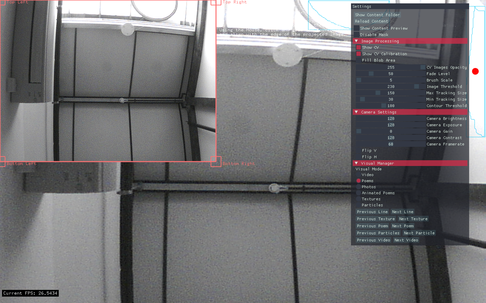
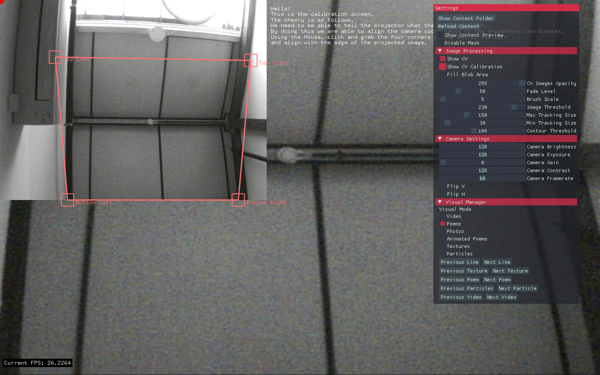
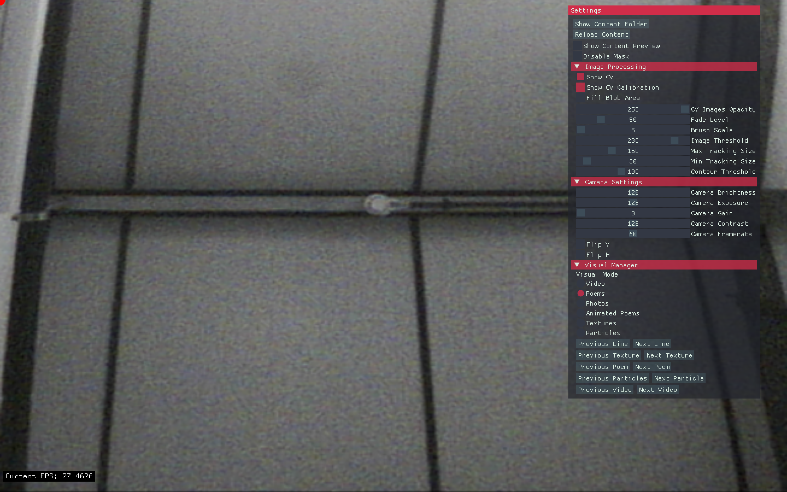

New Talent Residences 2018: Lawerence Hoo and Michael Jenkins
==

### Overview

Cargo Wall is a interactive content projection system.
The Audience are given a IR Torch which when pointed at a wall will reveal content.

### Equipment
Here is a list of Equipment we used and where to find the products. 

Item | Cost 
--- | ---
[PS3 Eye Camera](https://www.amazon.co.uk/Sony-PlayStation-Camera-Eyetoy-packed/dp/B00LME2JGQ/ref=sr_1_1?ie=UTF8&qid=1519318944&sr=8-1&keywords=ps3+camera&dpID=41FcXovv6SL&preST=_SX300_QL70_&dpSrc=srch) | £6.95
[Lee IR Filter](https://www.wexphotovideo.com/lee-87-ir-poly-filter-1010819/) | £19.95
[Infrared Torch](https://www.amazon.co.uk/Torch-850NM-Infrared-Vision-Flashlight/dp/B016ZPH470/ref=cts_sp_2_vtp) | £15.99

### Hardware Hack

We removed the IR Blocking Filter in ther lens and put a Visible Light Filter in its place. This stops the projected image appearing in the tracking image.

This site does a better job of explaining the process than I can manage.

[https://www.behance.net/gallery/8955421/Hacking-Sony-PS3-Eye-Camera](https://www.behance.net/gallery/8955421/Hacking-Sony-PS3-Eye-Camera)

### Setup

There are only a few setup steps needed for the application run, these are mainly calibration steps.

With the application open. 

Open the GUI by pressing TAB.

Click Show Folder to expose the content directory.

- Any Poems that need to be show should be placed in the Visual/poems folder.
- Any Video should be placed in the Visual/videos folder.
- Any Photos should be placed in the Visual/photos folder.
- Any Textures should be placed in the Visual/textures folder.

Click Reload. 

This will add the content to the application.
See the next section for image calibration.

### Region of Interest

We need to constrain/rework the camera coordinates to be the same as the projector coordinates. In the Gui Click Show CV Calibration.

It will open a subsection of the application, using the mouse drag the corners of the rectangle so that they roughely align with the corners of the projected image. Remember the camera won't be able to see the projected image. Once done Click Save. Next time the application opens the calibration will be automatically loaded.

#### Pre Warp

#### Warped

#### Post Warped

### Addons Required

- [ofxAutoReloadedShader](http://github.com/andreasmuller/ofxAutoReloadedShader)
- [ofxCv](http://github.com/kylemcdonald/ofxCv)
- [ofxImGui](http://github.com/jvcleave/ofxImGui)
- [ofxJSON](http://github.com/jeffcrouse/ofxJSON)
- [ofxKinect]()
- [ofxOpenCv]()
- [ofxPS3EyeGrabber](http://github.com/bakercp/ofxPS3EyeGrabber)
- [ofxTextAlign](http://github.com/nariakiiwatani/ofxTextAlign)
- [ofxTween](http://github.com/arturoc/ofxTween)
- [ofxXmlSettings]()

### Files

File | Purpose
--- | ---
main.cpp | Runs the ofApp code
ofApp.cpp | Main code thread
ofApp.h | 
AnimatedPoems.h | Tweens Lines from the Poems 
Photos.h | Displays photos 
Poems.h | Loads poems and displays them on screen
Videos.h | Loads Videos and displays them on screen
VisualManager.cpp + .h | Handles the Visual Components of the App
ofxCenteredTrueTypeFont.h | Small Class that centers true type to a container
Timer.cpp + .h | Custom  Timer Class
ImageProcessing.cpp + h | Handles the Camera system and performs the openCv methods to get the torch image 
ImageSelection.cpp + .h | Allows us to segment the image so we can select a specific region of the camera's view.

### ToDo