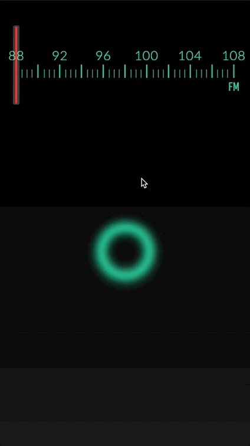
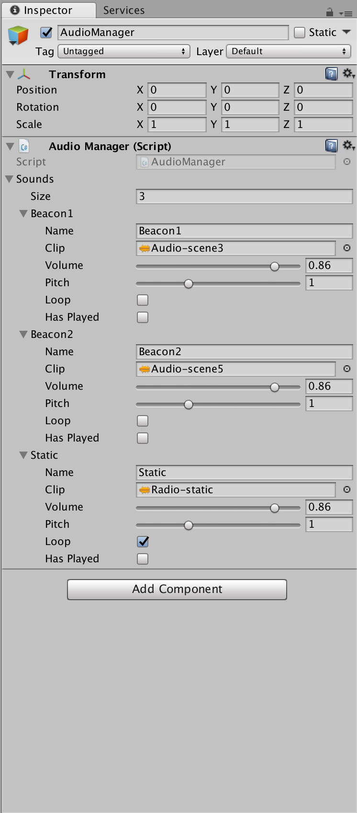
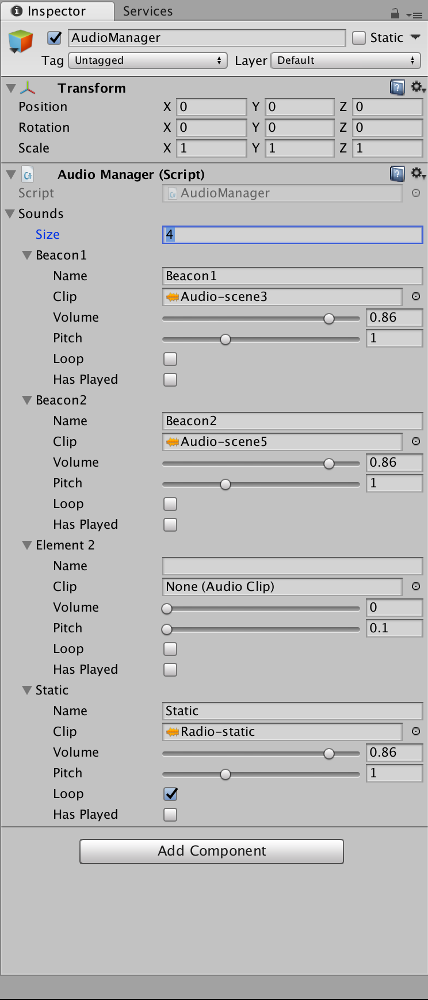

New Talent Residences 2018: Nicola Hogg and Alec Stevens
==

### Overview
Short, Back and Sides is a Mobile Audio experience that turns the users device into a radio which needs to be tuned to specific frequencies to hear stories.



### Build

The Software was built in **Unity** and is compatible with both **Android** and **iOS**. The only stipulation is that the devices need to have **GPS**. It is advisable that the devices also have a screen protector as the user will be invited to use a custom made dial to tune the phone to the correct frequencies.

### Defining the Audio Triggers

***We could do away with the json object to be honest but might be useful in future if you need to do web loading.***

Inside the Streaming Assets folder there is a **beacons.json** file. This contains information about the beacons, its a json array each object has the following attributes.

```
{
      "beaconid": "Beacon1",
      "radius": 100,
      "lat": 0.0000000,
      "lng": -0.0000000,
      "tuning": 102.5,
      "genericid": 1
}
``` 
The entire object is passed up by the manager when you enter a gps zone. However, we only need to the tuning and *beaconid* attribute to go into the **TouchManager**. The current angle of the dial on the screen is evaluated against the *tuning* attribute and when they match, the *beaconid* is passed into the **AudioManager**, which plays the relevant track.

#### Setting New Tracks 

Click on the AudioManager GameObject.

You'll see this interface.



Increase the size of the object.



This will insert a new object into the list.

Name the Trigger. 

Make sure it is identical to the one in the json file so if Track XX needs to play when you enter Zone XX, It needs to be defined.

Set the Pitch to 1 and the Volume to the wanted level.

### Dial Mechanics

We have converted the principles of [Paul Ferragut's Touch Object](https://github.com/paul-ferragut/oscTouchObject) into C# to enable the dial interaction.

But what happens is as follows.

1. Check if there are three or more touches.
2. Calculate the touch point which is the furthest away from the other points *indexOfTop*.
3. Calculate the Bounding Box for the touches.
4. Calculate the Orientation based on the *indexOfTop*

We then map this value to the range of the tuner.
If this value is within the range of any of the Beacons then we start playing the audio.

**Calculate the Orientation**

Pseudoish code

```
function calculateOrientation(touches,indexOfTop)
	Vec2 a, b, c
	
	// Assign the Top Point
	b = touches[indexOfTop].pos
	
	// Assign the other two touches
	if indexOfTop == 0
		a = touches[1].pos
		c = touches[2].pos
		
	elif indexOfTop == 1
		a = touches[0].pos
		c = touches[2].pos
		
	elif indexOfTop == 2
		a = touches[0].pos
		c = touches[1].pos
		
	// Calculate Center Point
	Vec2 center = Lerp a and c by 0.5
	
	// Calculate the Difference
	Vec2 Diff = b - center
	
	// Normalize
	diff.Normalize
	
	// Calculate Radians
	float radians = atan2(diff)
	
	// Rotate around Zero
	if radians < 0.0
		radians += 2.0f * PI
	
	// Convert to Degrees
	float degrees = radians * 180.0 / PI

	return degrees
```

### Files

File | Purpose
--- | ---
**AudioManger.cs** | Handles the Audio Output and Playback
**Sound.cs** | Sound Object holds information about each audio track, ie should it loop play on awake.
**Beacon.cs** | Holds Information regarding the beacons or geofence areas. It also computes the distance from the center of the zone to the user. 
**BeaconManager.cs** | Handles loading the beacons and sets the GPS location for each of the beacons.
**GPSManager.cs** | Handles the application's interaction with the devices GPS.
**GPSRender.cs** | Displays the Current GPS coordinate though this is only for debug and should never be seen by the audience.
**MainMenu.cs** | Handles the Main Menu
**TouchManager.cs** | Handles the Touch input from the user. It also triggers content depending on the users input.
**UserManager.cs** | (Unused) this would be the mechanic that checks where the user is in the story currently.

### Fonts Used

* [Lato](https://fonts.google.com/specimen/Lato)
* [Quicksand](https://fonts.google.com/specimen/Quicksand)
* [Teko](https://fonts.google.com/specimen/Teko)

### Assets

Asset | Price
--- | ---
[Text Mesh Pro](https://assetstore.unity.com/packages/essentials/beta-projects/textmesh-pro-84126) | Free (Recommended for all projects)
[Tween](https://assetstore.unity.com/packages/tools/animation/tween-55983) | Free 
[ShaderForge]() | $40 (This is Optional)
